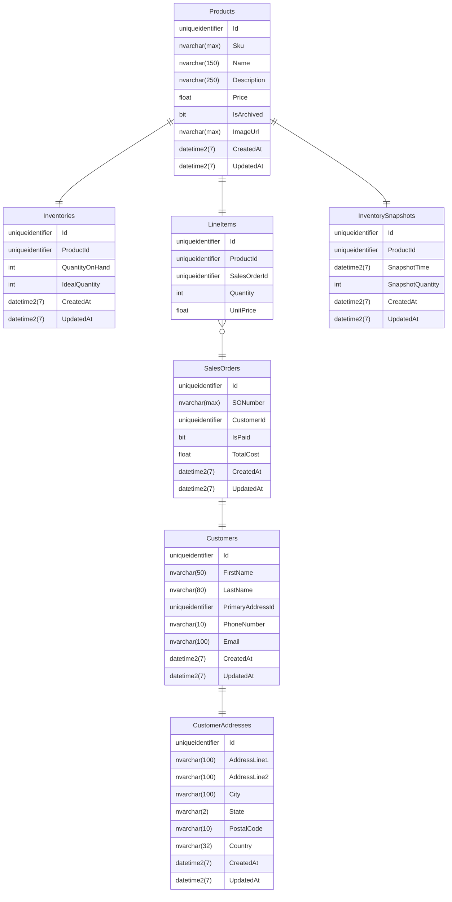

# ArtisanGemstoneIMS

## ER Diagram

```mermaid
erDiagram
    Products {
        uniqueidentifier Id
        nvarchar(max) Sku
        nvarchar(150) Name
        nvarchar(250) Description
        float Price
        bit IsArchived
        nvarchar(max) ImageUrl
        datetime2(7) CreatedAt
        datetime2(7) UpdatedAt
    }
    Inventories {
        uniqueidentifier Id
        uniqueidentifier ProductId
        int QuantityOnHand
        int IdealQuantity
        datetime2(7) CreatedAt
        datetime2(7) UpdatedAt
    }
    LineItems {
        uniqueidentifier Id
        uniqueidentifier ProductId
        uniqueidentifier SalesOrderId
        int Quantity
        float UnitPrice
    }
    SalesOrders {
        uniqueidentifier Id
        nvarchar(max) SONumber
        uniqueidentifier CustomerId
        bit IsPaid
        float TotalCost
        datetime2(7) CreatedAt
        datetime2(7) UpdatedAt
    }
    Customers {
        uniqueidentifier Id
        nvarchar(50) FirstName
        nvarchar(80) LastName
        uniqueidentifier PrimaryAddressId
        nvarchar(10) PhoneNumber
        nvarchar(100) Email
        datetime2(7) CreatedAt
        datetime2(7) UpdatedAt
    }
    CustomerAddresses {
        uniqueidentifier Id
        nvarchar(100) AddressLine1
        nvarchar(100) AddressLine2
        nvarchar(100) City
        nvarchar(2) State
        nvarchar(10) PostalCode
        nvarchar(32) Country
        datetime2(7) CreatedAt
        datetime2(7) UpdatedAt
    }
    InventorySnapshots {
        uniqueidentifier Id
        uniqueidentifier ProductId
        datetime2(7) SnapshotTime
        int SnapshotQuantity
        datetime2(7) CreatedAt
        datetime2(7) UpdatedAt
    }
    Products ||--|| LineItems : ""
    Products ||--|| Inventories : ""
    Products ||--|| InventorySnapshots: ""
    LineItems }o--|| SalesOrders : ""
    SalesOrders ||--|| Customers : ""
    Customers ||--|| CustomerAddresses: ""
```