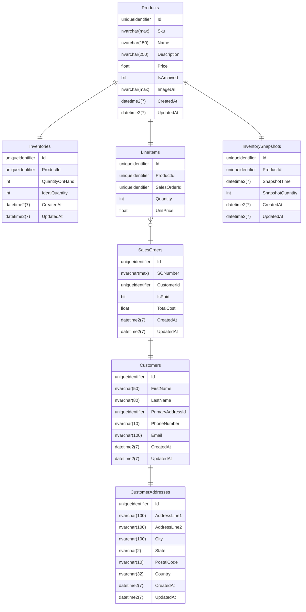
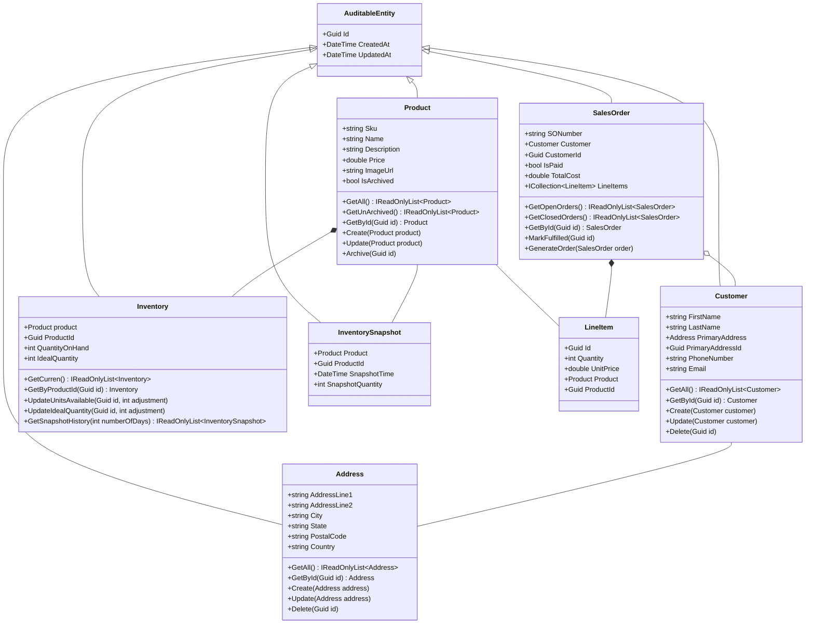

# ArtisanGemstoneIMS

## ER Diagram

```mermaid
erDiagram
    Products {
        uniqueidentifier Id
        nvarchar(max) Sku
        nvarchar(150) Name
        nvarchar(250) Description
        float Price
        bit IsArchived
        nvarchar(max) ImageUrl
        datetime2(7) CreatedAt
        datetime2(7) UpdatedAt
    }
    Inventories {
        uniqueidentifier Id
        uniqueidentifier ProductId
        int QuantityOnHand
        int IdealQuantity
        datetime2(7) CreatedAt
        datetime2(7) UpdatedAt
    }
    LineItems {
        uniqueidentifier Id
        uniqueidentifier ProductId
        uniqueidentifier SalesOrderId
        int Quantity
        float UnitPrice
    }
    SalesOrders {
        uniqueidentifier Id
        nvarchar(max) SONumber
        uniqueidentifier CustomerId
        bit IsPaid
        float TotalCost
        datetime2(7) CreatedAt
        datetime2(7) UpdatedAt
    }
    Customers {
        uniqueidentifier Id
        nvarchar(50) FirstName
        nvarchar(80) LastName
        uniqueidentifier PrimaryAddressId
        nvarchar(10) PhoneNumber
        nvarchar(100) Email
        datetime2(7) CreatedAt
        datetime2(7) UpdatedAt
    }
    CustomerAddresses {
        uniqueidentifier Id
        nvarchar(100) AddressLine1
        nvarchar(100) AddressLine2
        nvarchar(100) City
        nvarchar(2) State
        nvarchar(10) PostalCode
        nvarchar(32) Country
        datetime2(7) CreatedAt
        datetime2(7) UpdatedAt
    }
    InventorySnapshots {
        uniqueidentifier Id
        uniqueidentifier ProductId
        datetime2(7) SnapshotTime
        int SnapshotQuantity
        datetime2(7) CreatedAt
        datetime2(7) UpdatedAt
    }
    Products ||--|| LineItems : ""
    Products ||--|| Inventories : ""
    Products ||--|| InventorySnapshots: ""
    LineItems }o--|| SalesOrders : ""
    SalesOrders ||--|| Customers : ""
    Customers ||--|| CustomerAddresses: ""
```

## Class Diagram

```mermaid
classDiagram
    AuditableEntity <|-- Product
    AuditableEntity <|-- Address
    AuditableEntity <|-- Customer
    AuditableEntity <|-- Inventory
    AuditableEntity <|-- InventorySnapshot
    AuditableEntity <|-- SalesOrder
    Product -- LineItem
    Product *-- Inventory
    Product -- InventorySnapshot
    Customer -- Address
    SalesOrder *-- LineItem
    SalesOrder o-- Customer
    class AuditableEntity {
        +Guid Id
        +DateTime CreatedAt
        +DateTime UpdatedAt
    }
    class Product {
        +string Sku
        +string Name
        +string Description
        +double Price
        +string ImageUrl
        +bool IsArchived
        +GetAll() IReadOnlyList~Product~
        +GetUnArchived() IReadOnlyList~Product~
        +GetById(Guid id) Product
        +Create(Product product)
        +Update(Product product)
        +Archive(Guid id)
    }
    class Address {
        +string AddressLine1
        +string AddressLine2
        +string City
        +string State
        +string PostalCode
        +string Country
        +GetAll() IReadOnlyList~Address~
        +GetById(Guid id) Address
        +Create(Address address)
        +Update(Address address)
        +Delete(Guid id)
    }
    class Customer {
        +string FirstName
        +string LastName
        +Address PrimaryAddress
        +Guid PrimaryAddressId
        +string PhoneNumber
        +string Email
        +GetAll() IReadOnlyList~Customer~
        +GetById(Guid id) Customer
        +Create(Customer customer)
        +Update(Customer customer)
        +Delete(Guid id)
    }
    class Inventory {
        +Product product
        +Guid ProductId
        +int QuantityOnHand
        +int IdealQuantity
        +GetCurren() IReadOnlyList~Inventory~
        +GetByProductId(Guid id) Inventory
        +UpdateUnitsAvailable(Guid id, int adjustment)
        +UpdateIdealQuantity(Guid id, int adjustment)
        +GetSnapshotHistory(int numberOfDays) IReadOnlyList~InventorySnapshot~
    }
    class InventorySnapshot {
        +Product Product
        +Guid ProductId
        +DateTime SnapshotTime
        +int SnapshotQuantity
    }
    class SalesOrder {
        +string SONumber
        +Customer Customer
        +Guid CustomerId
        +bool IsPaid
        +double TotalCost
        +ICollection~LineItem~ LineItems
        +GetOpenOrders() IReadOnlyList~SalesOrder~
        +GetClosedOrders() IReadOnlyList~SalesOrder~
        +GetById(Guid id) SalesOrder
        +MarkFulfilled(Guid id)
        +GenerateOrder(SalesOrder order) 
    }
    class LineItem {
        +Guid Id
        +int Quantity
        +double UnitPrice
        +Product Product
        +Guid ProductId
    }
```